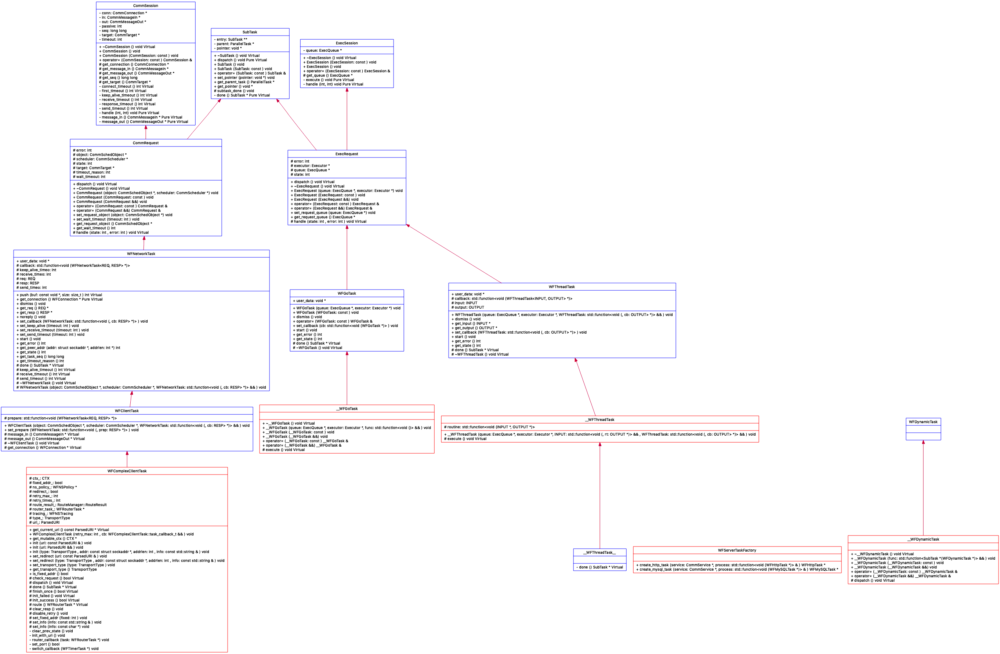

## http流程

通过cgdb ./http_req 流程分析

首先创建一个http task

```cpp
// demos/07_http/http_req.cc
WFHttpTask *task = WFTaskFactory::create_http_task(url,
                                                    REDIRECT_MAX,
                                                    RETRY_MAX,
                                                    http_callback);
```

```cpp 
// src/factory/WFTaskFactory.h
class WFTaskFactory
{
// 创建协议相关的应用层task
// 其实现在xxxTaskImpl.cc中
public:
	static WFHttpTask *create_http_task(const std::string& url,
										int redirect_max,
										int retry_max,
										http_callback_t callback);
    ...
};
```

```cpp
// src/factory/HttpTaskImpl.cc
WFHttpTask *WFTaskFactory::create_http_task(const std::string& url,
											int redirect_max,
											int retry_max,
											http_callback_t callback)
{
	auto *task = new ComplexHttpTask(redirect_max,
									 retry_max,
									 std::move(callback));
	ParsedURI uri;

	URIParser::parse(url, uri);
	task->init(std::move(uri));
	task->set_keep_alive(HTTP_KEEPALIVE_DEFAULT);
	return task;
}
```

可见我们的task是一个ComplexHttpTask。还有一个重要的部分是ParsedURI。

### ComplexHttpTask UML



“+”表示 public；

“-”表示 private；

“#”表示 protected；

不带符号表示 default。

## 自顶向下分析

最顶层CommRequest 继承自 SubTask 和 CommSession

