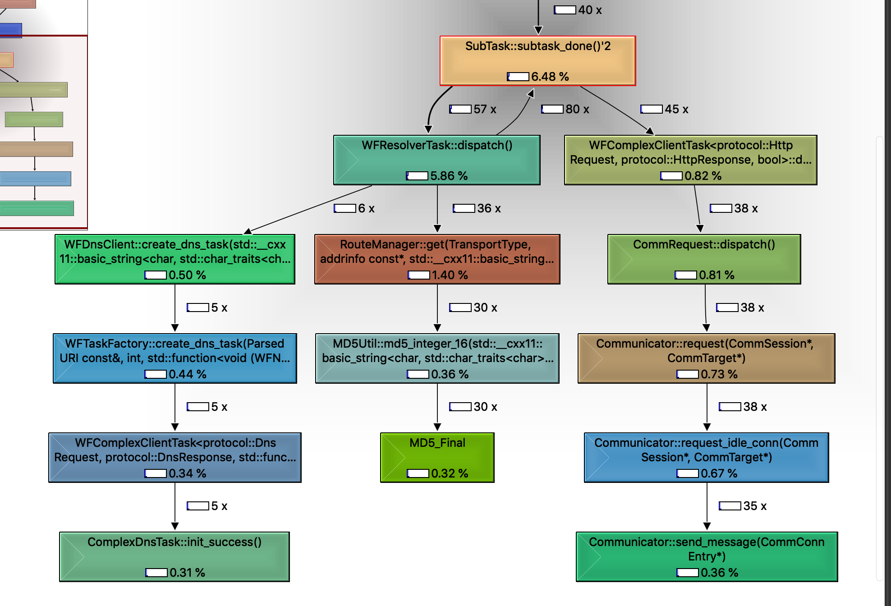

# workflow 源码解析 04 : http 

我们由最简单的例子来分析一下http的流程

我们gdb启动最简单的demo

https://github.com/chanchann/workflow_annotation/blob/main/demos/07_http/http_req.cc

首先我们创建出http task

然后task->start()起来

```cpp
template<class REQ, class RESP>
class WFNetworkTask : public CommRequest
{
public:
	/* start(), dismiss() are for client tasks only. */
	void start()
	{
		assert(!series_of(this));
		Workflow::start_series_work(this, nullptr);
	}
    ...
};
```

我们所有的task都在series中进行，所以我们不能让这个裸的task执行，先给他创建series_work

```cpp
inline void
Workflow::start_series_work(SubTask *first, series_callback_t callback)
{
	new SeriesWork(first, std::move(callback));
	first->dispatch();
}
```

我们先来观察一下SeriesWork的结构

```cpp

class SeriesWork
{
....
protected:
	void *context;
	series_callback_t callback;
private:
	SubTask *first;  
	SubTask *last;   
	SubTask **queue;  
	int queue_size;
	int front;
	int back;
	bool in_parallel;
	bool canceled;
	std::mutex mutex;
};

```

所以我们在new 构造的时候，初始化一下

```cpp
SeriesWork::SeriesWork(SubTask *first, series_callback_t&& cb) :
	callback(std::move(cb))
{
	this->queue = new SubTask *[4];
	this->queue_size = 4;
	this->front = 0;
	this->back = 0;
	this->in_parallel = false;
	this->canceled = false;
	first->set_pointer(this);
	this->first = first;
	this->last = NULL;
	this->context = NULL;
}
```

注意我们这里first->set_pointer(this); 把subTask和这个SeriesWork绑定了起来

然后第一个任务，dispatch

我们从create_http_task中知道，我们创建的task其实是ComplexHttpTask

而ComplexHttpTask继承自WFComplexClientTask<HttpRequest, HttpResponse>

需要注意的是SubTask要求用户实现两个接口，dispatch和done。

而我们在WFComplexClientTask中实现。其中我们first->dispatch()调用的就是这个地方

```cpp
template<class REQ, class RESP, typename CTX>
void WFComplexClientTask<REQ, RESP, CTX>::dispatch()
{
	switch (this->state)
	{
	case WFT_STATE_UNDEFINED:  // 这个状态走了
		if (this->check_request())  // 这里直接return true
		{
			if (this->route_result_.request_object)  // 这里是NULL
			{
	case WFT_STATE_SUCCESS:
				this->set_request_object(route_result_.request_object);
				this->WFClientTask<REQ, RESP>::dispatch();
				return;
			}
            // 所以直接过来了，产生route做dns解析
			router_task_ = this->route();
			series_of(this)->push_front(this);
			series_of(this)->push_front(router_task_);
		}

	default:
		break;
	}

	this->subtask_done();
}
```

我们知道了怎么插入dns解析之一部分

但是dns部分我们忽略，等到dns章节解析时候再来详细分析,



从图中我们可知WFRsolverTask dispatch，创建dns task进行域名解析

而右边部分则是我们http 请求任务了

