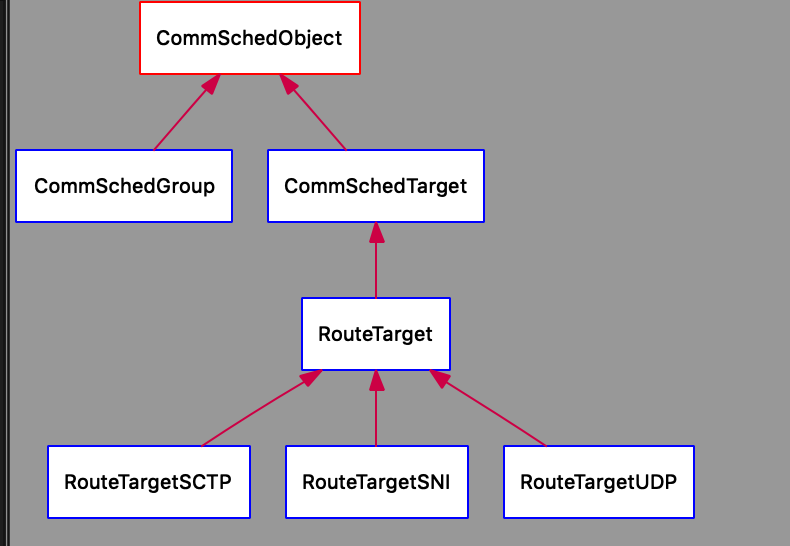

# workflow 源码解析 04 : http 

我们先看最简单的http例子

https://github.com/chanchann/workflow_annotation/blob/main/demos/07_http/http_req.cc

## create_http_task

首先我们创建出http task

```cpp
WFHttpTask *WFTaskFactory::create_http_task(const std::string& url,
											int redirect_max,
											int retry_max,
											http_callback_t callback)
{
	auto *task = new ComplexHttpTask(redirect_max,
									 retry_max,
									 std::move(callback));
	ParsedURI uri;

	URIParser::parse(url, uri);
	task->init(std::move(uri));
	task->set_keep_alive(HTTP_KEEPALIVE_DEFAULT);
	return task;
}
```

## ComplexHttpTask

我们实际上是new了ComplexHttpTask

```cpp
class ComplexHttpTask : public WFComplexClientTask<HttpRequest, HttpResponse>
{
public:
	ComplexHttpTask(int redirect_max,
					int retry_max,
					http_callback_t&& callback):
		WFComplexClientTask(retry_max, std::move(callback)),
		redirect_max_(redirect_max),
		redirect_count_(0)
	{
		...
	}

protected:
	virtual CommMessageOut *message_out();
	virtual CommMessageIn *message_in();
	virtual int keep_alive_timeout();
	virtual bool init_success();
	virtual void init_failed();
	virtual bool finish_once();

protected:
	bool need_redirect(ParsedURI& uri);
	bool redirect_url(HttpResponse *client_resp, ParsedURI& uri);
	void set_empty_request();

private:
	int redirect_max_;  
	int redirect_count_;
};
```

我们在这里添加了http相关的功能

这些重要的功能后面用到再细说

### WFComplexClientTask<HttpRequest, HttpResponse>

而ComplexHttpTask继承自WFComplexClientTask<HttpRequest, HttpResponse>

已经是用了相应的protocol实例化

```cpp

template<class REQ, class RESP, typename CTX = bool>
class WFComplexClientTask : public WFClientTask<REQ, RESP>
{
protected:
	using task_callback_t = std::function<void (WFNetworkTask<REQ, RESP> *)>;

public:
	WFComplexClientTask(int retry_max, task_callback_t&& cb):
		WFClientTask<REQ, RESP>(NULL, WFGlobal::get_scheduler(), std::move(cb))
	{
		type_ = TT_TCP;
		fixed_addr_ = false;
		retry_max_ = retry_max;
		retry_times_ = 0;
		redirect_ = false;
		ns_policy_ = NULL;
		router_task_ = NULL;
	}

protected:
	// new api for children
	virtual bool init_success() { return true; }
	virtual void init_failed() {}
	virtual bool check_request() { return true; }
	virtual WFRouterTask *route();
	virtual bool finish_once() { return true; }

public:
	void init(const ParsedURI& uri);
	void init(ParsedURI&& uri);
	void init(TransportType type,
			  const struct sockaddr *addr,
			  socklen_t addrlen,
			  const std::string& info);

	void set_transport_type(TransportType type);

	TransportType get_transport_type() const { return type_; }

	virtual const ParsedURI *get_current_uri() const { return &uri_; }

	void set_redirect(const ParsedURI& uri);

	void set_redirect(TransportType type, const struct sockaddr *addr,
					  socklen_t addrlen, const std::string& info);

protected:
	void set_info(const std::string& info);
	void set_info(const char *info);

	virtual void dispatch();
	virtual SubTask *done();

	void clear_resp();
	void disable_retry();


	TransportType type_;
	ParsedURI uri_;
	std::string info_;
	bool fixed_addr_;
	bool redirect_;
	CTX ctx_;
	int retry_max_;
	int retry_times_;
	WFNSPolicy *ns_policy_;
	WFRouterTask *router_task_;
	RouteManager::RouteResult route_result_;
	WFNSTracing tracing_;

public:
	CTX *get_mutable_ctx() { return &ctx_; }

private:
	void clear_prev_state();
	void init_with_uri();
	bool set_port();
	void router_callback(WFRouterTask *task);
	void switch_callback(WFTimerTask *task);
};

```

需要注意的是SubTask要求用户实现两个接口，dispatch和done。

而我们在WFComplexClientTask中实现。其中我们first->dispatch()调用的就是这个地方

```cpp
template<class REQ, class RESP, typename CTX>
void WFComplexClientTask<REQ, RESP, CTX>::dispatch()
{
	switch (this->state)
	{
	case WFT_STATE_UNDEFINED:  // 这个状态走了
		if (this->check_request())  // 这里直接return true
		{
			if (this->route_result_.request_object)  // 这里是NULL
			{
	case WFT_STATE_SUCCESS:
				this->set_request_object(route_result_.request_object);
				this->WFClientTask<REQ, RESP>::dispatch();
				return;
			}
            // 所以直接过来了，产生route做dns解析
			router_task_ = this->route();
			series_of(this)->push_front(this);
			series_of(this)->push_front(router_task_);
		}

	default:
		break;
	}

	this->subtask_done();
}
```

我们知道了怎么插入dns解析之一部分

但是dns部分我们忽略，等到dns章节解析时候再来详细分析,


从图中我们可知WFRsolverTask dispatch，创建dns task进行域名解析

而右边部分则是我们http 请求任务了

看名字就可以看出，从CommRequest::dispatch就是发送req

我们gdb跟踪一下这个函数, 第一次bt发现是WFResolverTask, 第二次还是WFResolverTask

todo : 仔细分析为什么是两次

第三次才算到发消息

```
#0  CommRequest::dispatch (this=0x55555586fad0) at /home/ysy/workflow/src/kerne
l/CommRequest.cc:38
#1  0x00005555555d8112 in Communicator::handle_incoming_reply (this=0x555555858
448 <__CommManager::get_instance()::kInstance+8>, res=0x7fffe4000dc0) at /home/
ysy/workflow/src/kernel/Communicator.cc:691
#2  0x00005555555d823d in Communicator::handle_read_result (this=this@entry=0x5
55555858448 <__CommManager::get_instance()::kInstance+8>, res=res@entry=0x7fffe
4000dc0) at /home/ysy/workflow/src/kernel/Communicator.cc:708
#3  0x00005555555d9dfb in Communicator::handler_thread_routine (context=context
@entry=0x555555858448 <__CommManager::get_instance()::kInstance+8>) at /home/ys
y/workflow/src/kernel/Communicator.cc:1093
#4  0x00005555555f0cdd in __thrdpool_routine (arg=0x55555586c380) at /home/ysy/
workflow/src/kernel/thrdpool.c:72
#5  0x00007ffff7bbb6db in start_thread (arg=0x7ffff4523700) at pthread_create.c
:463
#6  0x00007ffff6beb71f in clone () at ../sysdeps/unix/sysv/linux/x86_64/clone.S
:95
```

我们这里自己思考下，如果我们要发get请求，怎么做？

我们肯定要先connect，然后把发送请求，因为是异步，我们得把这个接收事件给epoll监听上

所以我们先从CommRequest::dispatch()看起

## CommRequest::dispatch 组成

```cpp
void CommRequest::dispatch()
{
	// 发送请求
	this->scheduler->request(this, this->object, this->wait_timeout,
								 &this->target);
	...
}

```

首先这里关注两点

1. 首先CommRequest 继承自SubTask和CommSession

说明CommRequest是一个SubTask，又满足CommSession的特性

CommSession是一次req->resp的交互，主要要实现message_in(), message_out()等几个虚函数，让核心知道怎么产生消息。

```cpp
class CommRequest : public SubTask, public CommSession
```

2. 这里的scheduler是CommScheduler

看名字像是调度器

## 我们这里有个疑问了，这个CommRequest，scheduler 是什么时候构造出来的呢？

唯一的入口在构造WFNetworkTask的时候

```
// perl calltree.pl "CommRequest" "" 1 1 2

CommRequest
└── WFNetworkTask     [vim src/factory/WFTask.h +326]
```

```cpp
// src/factory/WFTask.h
WFNetworkTask(CommSchedObject *object, CommScheduler *scheduler,
				std::function<void (WFNetworkTask<REQ, RESP> *)>&& cb) :
	CommRequest(object, scheduler),
	callback(std::move(cb))
{
	... 一些初始化
}
```


我们可以看出

我们的ClientTask就是继承自WFNetworkTask

所以我们在创建task的时候，这些东西就都创建了

而我们的scheduler顾名思义，一个调度器，肯定是个全局调度，得是个单例

我们的单例是__CommManager，他是其中的一个组合模式的成员，生命周期相同

```cpp
CommScheduler *WFGlobal::get_scheduler()
{
	return __CommManager::get_instance()->get_scheduler();
}
```

```cpp
class __CommManager
{
public:
	CommScheduler *get_scheduler() { return &scheduler_; }
	...
private:
	__CommManager():
		io_server_(NULL),
		io_flag_(false),
		dns_manager_(NULL),
		dns_flag_(false)
	{
		const auto *settings = __WFGlobal::get_instance()->get_global_settings();
		if (scheduler_.init(settings->poller_threads,
							settings->handler_threads) < 0)
			abort();

		signal(SIGPIPE, SIG_IGN);
	}
private:
	CommScheduler scheduler_;
	...
};
```

所以在生成__CommManager单例的时候，构造了CommScheduler并初始化

之前章节我们就已经跟到这里过，__CommManager单例第一次实例化的时候，CommScheduler init，然后Communicator init, 产生poller线程和线程池，并启动了poller线程。

## CommRequest::dispatch 函数中需要的参数(CommSchedObject，CommTarget)

回到此处

```cpp
void CommRequest::dispatch()
{
	// 发送请求
	this->scheduler->request(this, this->object, this->wait_timeout,
								 &this->target);
	...
}

```

这里就做一件事scheduler->request，其中需要CommSchedObject，CommTarget



从WFNetworkTask中可以看出，CommSchedObject是传进来的，最开始在构造的时候，传入的是NULL

```cpp
	WFComplexClientTask(int retry_max, task_callback_t&& cb):
		WFClientTask<REQ, RESP>(NULL, WFGlobal::get_scheduler(), std::move(cb))
	{
		...
	}
```

而什么时候才初始化呢? 在WFComplexClientTask的dispatch中set_request_object

```cpp
template<class REQ, class RESP, typename CTX>
void WFComplexClientTask<REQ, RESP, CTX>::dispatch()
{
	switch (this->state)
	{
	case WFT_STATE_UNDEFINED:
		if (this->check_request())
		{
			if (this->route_result_.request_object)
			{
	case WFT_STATE_SUCCESS:
				this->set_request_object(route_result_.request_object);
				this->WFClientTask<REQ, RESP>::dispatch();
				return;
			}
	...
}
```

这里如何产生的route_result_.request_object，是通过dns去做的，这里先略过，在dns那一节详细阐述。

可以看出我们给个url，dns解析出来之后，我们有了request的目标了

```cpp
class CommSchedObject
{
private:
	virtual CommTarget *acquire(int wait_timeout) = 0;

protected:
	size_t max_load;
	size_t cur_load;
	...
};
```

从这个类成员可以看出，大概是为了负载均衡而设计的。

## CommTarget

而CommTarget是通讯目标，基本上就是ip+port, 还有两个超时参数。连接池什么的都在target里。

CommTarget是在`scheduler->request()`中生成的

```cpp
int request(CommSession *session, CommSchedObject *object,
				int wait_timeout, CommTarget **target)

```

这里参数是CommTarget **target，是一个传出参数, 是从里面`object->acquire(wait_timeout);` 获取出来的

## 仔细解析scheduler->request

```cpp
int request(CommSession *session, CommSchedObject *object,
			int wait_timeout, CommTarget **target)
{

	...
	*target = object->acquire(wait_timeout);
	...
	this->comm.request(session, *target);

}
```

就做两件事，一件事获取通信target，一件是调用request去发request请求

