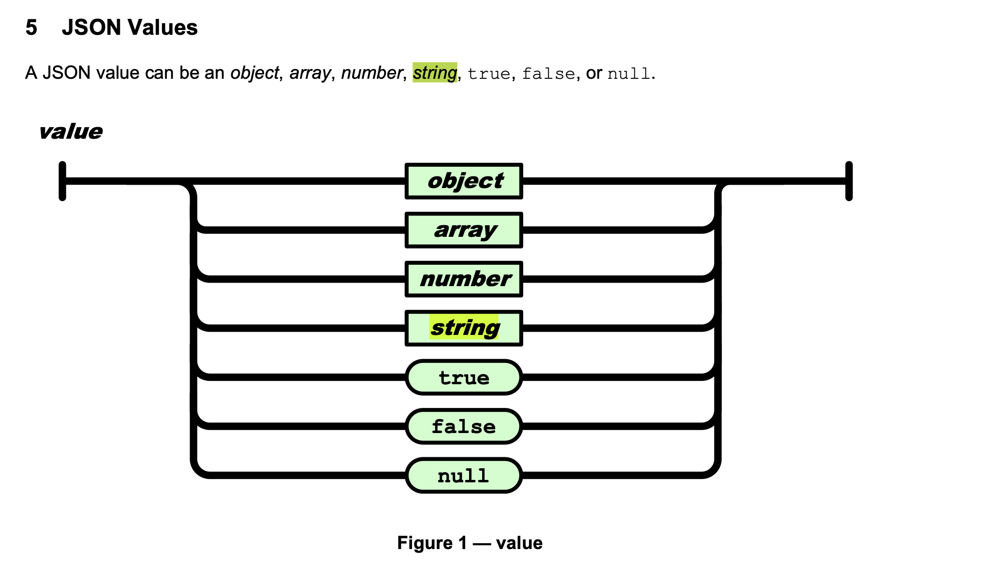
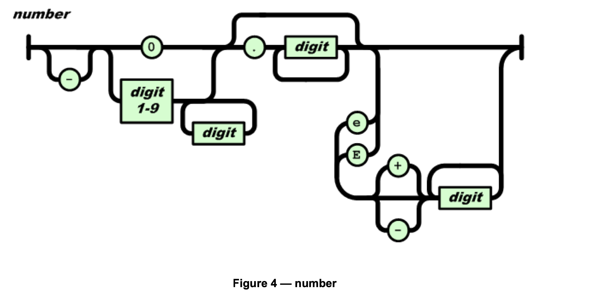
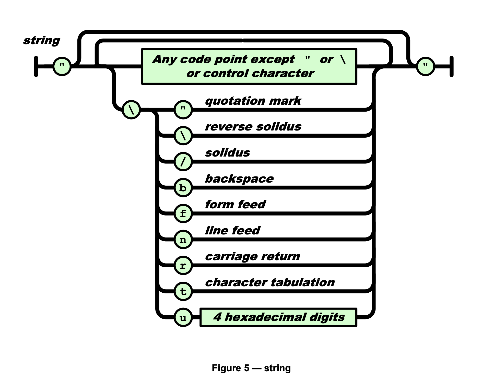
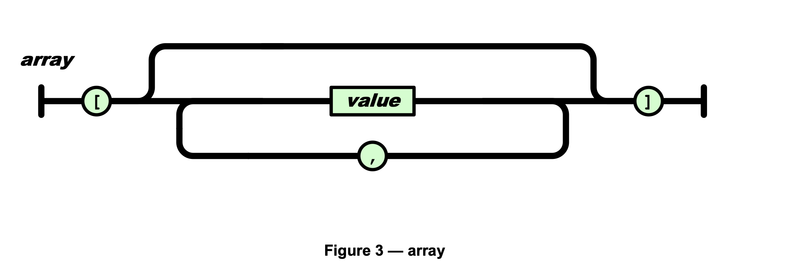
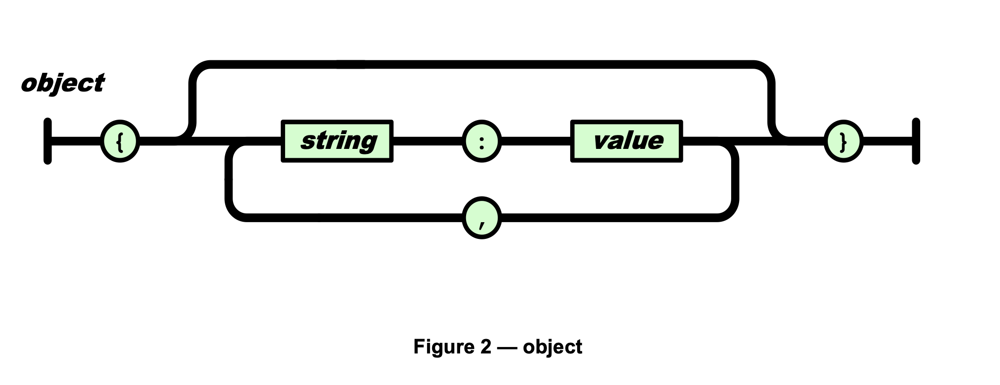

#! https://zhuanlan.zhihu.com/p/493430118
# Workflow 源码解析 Json parser ：part1 parse

项目地址 : https://github.com/Barenboim/json-parser

这是一个简单，性能高的json parser

我们要实现的 Json 库，主要是完成 3 个需求：

1.把 Json 文本解析为一个数据结构（parse）。

2.提供接口访问该数据结构（access）。

3.把数据结构转换成 Json 文本（stringify）。

我们第一部分，首先来分析第一个需求：解析Json文本

## 类型



JSON 只包含 6 种数据类型

null: 表示为 null

boolean: 表示为 true 或 false

number: 一般的浮点数表示方式

string: 表示为 "..."

array: 表示为 [ ... ]

object: 表示为 { ... }

如果把 true 和 false 当作两个类型就是 7 种

所以我们在此定义

```c
#define JSON_VALUE_STRING	1
#define JSON_VALUE_NUMBER	2
#define JSON_VALUE_OBJECT	3
#define JSON_VALUE_ARRAY	4
#define JSON_VALUE_TRUE		5
#define JSON_VALUE_FALSE	6
#define JSON_VALUE_NULL		7
```

## parse接口

我们先看接口

```c
/* 解析json文档产生json value。返回json value对象。返回NULL代表解析失败（格式不标准，嵌套过深，分配内存失败）
   @doc 文档字符串 */
json_value_t *json_value_parse(const char *doc);
```

首先，我们传入的是json字符串。

返回的是`json_value_t`

```c
typedef struct __json_value json_value_t;

struct __json_value
{
	int type;
	union
	{
		char *string;
		double number;
		json_object_t object;
		json_array_t array;
	} value;
};
```

可以看出，他主要有两个变量，一个是type，一个是他的值，这里用了union，不同类型的值有不同形式的value

从最上面的类型我们可以看到，这里有string, number(一般用double来表示)，array和object，还有null和boolean我们用type表示即可，不需要value。

## json_value_parse 实现

```c
json_value_t *json_value_parse(const char *doc)
{
	json_value_t *val;
	int ret;

	val = (json_value_t *)malloc(sizeof (json_value_t));
	if (!val)
		return NULL;

	while (isspace(*doc))
		doc++;

	ret = __parse_json_value(doc, &doc, 0, val);
	if (ret >= 0)
	{
		while (isspace(*doc))
			doc++;

		if (*doc)
		{
			__destroy_json_value(val);
			ret = -2;
		}
	}

	if (ret < 0)
	{
		free(val);
		return NULL;
	}

	return val;
}
```

根据[rfc7159](https://datatracker.ietf.org/doc/html/rfc7159)

```
JSON-text = ws value ws
```

中间valude我们先省略，首先首尾是有white space的，我们先跳过首部white space，对value进行解析

```c
while (isspace(*doc))
	doc++;
```

然后调用`ret = __parse_json_value(doc, &doc, 0, val);`, 这里就是对value的parse了，这也是我们json parser的核心

比起我们写编译原理，我们这里就简单很多了，不需要写分词器(tokenizer),只需检测第一个字符，便可以知道它是哪种类型的值

```
n ➔ null
t ➔ true
f ➔ false
" ➔ string
0-9/- ➔ number
[ ➔ array
{ ➔ object
```

```c
static int __parse_json_value(const char *cursor, const char **end,
							  int depth, json_value_t *val)
{
	int ret;

	switch (*cursor)
	{
	case '\"':
		// string

	case '-':
	case '0':
	case '1':
	case '2':
	case '3':
	case '4':
	case '5':
	case '6':
	case '7':
	case '8':
	case '9':
		// number

	case '{':
		// object
	
	case '[':
		// array

	case 't':
		// true

	case 'f':
		// false

	case 'n':
		// null

	default:
		return -2;
	}

	return 0;
}
```

我们先看最简单的null和boolean

## parse null

```c
case 'n':
	if (strncmp(cursor, "null", 4) != 0)
		return -2;

	*end = cursor + 4;
	val->type = JSON_VALUE_NULL;
	break;
```

直接strncmp，就可以判定是否为什么类型了，然后cursor相应往后移

## parser boolean

```c
case 't':
	if (strncmp(cursor, "true", 4) != 0)
		return -2;

	*end = cursor + 4;
	val->type = JSON_VALUE_TRUE;
	break;

case 'f':
	if (strncmp(cursor, "false", 5) != 0)
		return -2;

	*end = cursor + 5;
	val->type = JSON_VALUE_FALSE;
	break;
```

同理也是直接strncmp

## parse number



```
number = [ "-" ] int [ frac ] [ exp ]
int = "0" / digit1-9 *digit
frac = "." 1*digit
exp = ("e" / "E") ["-" / "+"] 1*digit
```

```c
// __parse_json_value
case '-':
case '0':
case '1':
case '2':
case '3':
case '4':
case '5':
case '6':
case '7':
case '8':
case '9':
	ret = __parse_json_number(cursor, end, &val->value.number);
	if (ret < 0)
		return ret;

	val->type = JSON_VALUE_NUMBER;
	break;
```

```c
static int __parse_json_number(const char *cursor, const char **end,
							   double *num)
{
	const char *p = cursor;

	if (*p == '-')
		p++;

	if (*p == '0' && (isdigit(p[1]) || p[1] == 'X' || p[1] == 'x'))
		return -2;

	*num = strtod(cursor, (char **)end);
	if (*end == cursor)
		return -2;

	return 0;
}
```

这里有必要说一下`strtod`，这个函数将C-string 转化为double类型。但是一些 JSON 不容许的格式，strtod() 也可转换，所以我们需要提前做格式校验。

具体参考[cpp ref](https://www.cplusplus.com/reference/cstdlib/strtod/)

```
for c99/c11

A valid floating point number for strtod using the "C" locale is formed by an optional sign character (+ or -), followed by one of:
- A sequence of digits, optionally containing a decimal-point character (.), optionally followed by an exponent part (an e or E character followed by an optional sign and a sequence of digits).
- A 0x or 0X prefix, then a sequence of hexadecimal digits (as in isxdigit) optionally containing a period which separates the whole and fractional number parts. Optionally followed by a power of 2 exponent (a p or P character followed by an optional sign and a sequence of hexadecimal digits).
- INF or INFINITY (ignoring case).
- NAN or NANsequence (ignoring case), where sequence is a sequence of characters, where each character is either an alphanumeric character (as in isalnum) or the underscore character (_).
```

我们如果先看到`-`,则跳过，如果后面的是0开头，后面还有数字, 则invalid，注意第二条`0x`, `0X` 也不满足要求，所以我们还要检查一下。

## parse string

```
string = quotation-mark *char quotation-mark
char = unescaped /
   escape (
       %x22 /          ; "    quotation mark  U+0022
       %x5C /          ; \    reverse solidus U+005C
       %x2F /          ; /    solidus         U+002F
       %x62 /          ; b    backspace       U+0008
       %x66 /          ; f    form feed       U+000C
       %x6E /          ; n    line feed       U+000A
       %x72 /          ; r    carriage return U+000D
       %x74 /          ; t    tab             U+0009
       %x75 4HEXDIG )  ; uXXXX                U+XXXX

escape = %x5C          ; \
quotation-mark = %x22  ; "
unescaped = %x20-21 / %x23-5B / %x5D-10FFFF
```


首先看到`"`便可能是string

```c
case '\"':
	cursor++;
	ret = __json_string_length(cursor);
	if (ret < 0)
		return ret;

	val->value.string = (char *)malloc(ret + 1);
	if (!val->value.string)
		return -1;

	ret = __parse_json_string(cursor, end, val->value.string);
	if (ret < 0)
	{
		free(val->value.string);
		return ret;
	}

	val->type = JSON_VALUE_STRING;
	break;
```

1. 首先获取长度

```c
static int __json_string_length(const char *cursor)
{
	int len = 0;

	while (1)
	{
		if (*cursor == '\"')
			break;

		if (*(const unsigned char *)cursor < ' ')
			return -2;

		cursor++;
		if (cursor[-1] == '\\')
		{
			if (!*cursor)
				return -2;

			cursor++;
		}

		len++;
	}

	return len;
}
```

一个字符串是`"xxx"`, 所以直到下一个`"`才break结束。

注意这里`if (*(const unsigned char *)cursor < ' ')`, 

32是空格, 0～31是控制字符或通信专用字符

无转义字符就是普通的字符，语法中列出了合法的码点范围。

```
unescaped = %x20-21 / %x23-5B / %x5D-10FFFF
```

要注意的是，该范围不包括 0 至 31、双引号和反斜线，这些码点都必须要使用转义方式表示

2. 分配空间

```c
val->value.string = (char *)malloc(ret + 1);
```

这里是ret + 1是因为还有一个`\0`

3. 解析string

```c
ret = __parse_json_string(cursor, end, val->value.string);
```

json共支持 9 种转义序列



```c
static int __parse_json_string(const char *cursor, const char **end,
							   char *str)
{
	int ret;

	while (*cursor != '\"')
	{
		if (*cursor == '\\')
		{
			cursor++;
			switch (*cursor)
			{
			case '\"':
				*str = '\"';
				break;
			case '\\':
				*str = '\\';
				break;
			....

			case 'u':
				cursor++;
				ret = __parse_json_unicode(cursor, &cursor, str);
				if (ret < 0)
					return ret;

				str += ret;
				continue;

			default:
				return -2;
			}
		}
		else
			*str = *cursor;

		cursor++;
		str++;
	}

	*str = '\0';
	*end = cursor + 1;
	return 0;
}
```

看图应该很清楚，在两个`"`之间，如果我们找到`\\`， 那么他如果合法的话，就应该是一个转移字符

如果后面不是那么9 种就不合理，这里比较特殊的就是`\uxxxx`这种序列, 这个代表unicode

如果是非转义字符，那我们直接复制过来即可`*str = *cursor;`

## 解析unicode 

在开始解析这部分之前，首先，我们要了解一下几个概念，什么是ascii, unicode, utf8

可以参考:

https://www.ruanyifeng.com/blog/2007/10/ascii_unicode_and_utf-8.html

https://zhuanlan.zhihu.com/p/22731540

C 标准库没有关于 Unicode 的处理功能（C++11 有），我们会实现 JSON 库所需的字符编码处理功能。

目前我们只支持utf8

我们分为以下三步：

```c
static int __parse_json_unicode(const char *cursor, const char **end,
								char *utf8)
{
	// step 1 : 读入4位16进制数
	ret = __parse_json_hex4(cursor, end, &code);

	// step 2 : 转化为码点
	if (code >= 0xdc00 && code <= 0xdfff)
		return -2;

	if (code >= 0xd800 && code <= 0xdbff)
	{
		cursor = *end;
		if (*cursor != '\\')
			return -2;

		cursor++;
		if (*cursor != 'u')
			return -2;

		cursor++;
		ret = __parse_json_hex4(cursor, end, &next);
		if (ret < 0)
			return ret;

    	if (next < 0xdc00 || next > 0xdfff)
			return -2;

		code = (((code & 0x3ff) << 10) | (next & 0x3ff)) + 0x10000;
	}

	// step 3 : encode utf8
	if (code <= 0x7f)
	{
		utf8[0] = code;
		return 1;
	}
	else if (code <= 0x7ff)
	{
		utf8[0] = 0xc0 | (code >> 6);
		utf8[1] = 0x80 | (code & 0x3f);
		return 2;
	}
    else if (code <= 0xffff)
	{
        utf8[0] = 0xe0 | (code >> 12);
		utf8[1] = 0x80 | ((code >> 6) & 0x3f);
		utf8[2] = 0x80 | (code & 0x3f);
		return 3;
	}
	else
	{
		utf8[0] = 0xf0 | (code >> 18);
		utf8[1] = 0x80 | ((code >> 12) & 0x3f);
		utf8[2] = 0x80 | ((code >> 6) & 0x3f);
		utf8[3] = 0x80 | (code & 0x3f);
		return 4;
	}
}
```

1. step1 : 我们先读 4 位 16 进制数字

```c
static int __parse_json_hex4(const char *cursor, const char **end,
							 unsigned int *code)
{
	int hex;
	int i;

	*code = 0;
	for (i = 0; i < 4; i++)
	{
		hex = *cursor;
		if (hex >= '0' && hex <= '9')
			hex = hex - '0';
		else if (hex >= 'A' && hex <= 'F')
			hex = hex - 'A' + 10;
		else if (hex >= 'a' && hex <= 'f')
			hex = hex - 'a' + 10;
		else
			return -2;

		*code = (*code << 4) + hex;
		cursor++;
    }

	*end = cursor;
	return 0;
}
```

2. 转化码点

- JSON字符串中的 \uXXXX 是以 16 进制表示码点 U+0000 至 U+FFFF

- unicode字符被收录为统一字符集（Universal Coded Character Set, UCS），每个字符映射至一个整数码点（code point）, 码点的范围是 0 至 0x10FFFF，码点又通常记作 U+XXXX，当中 XXXX 为 16 进位数字

那么我们发现，4 位的 16 进制数字只能表示 0 至 0xFFFF，UCS 的码点是从 0 至 0x10FFFF，那怎么能表示多出来的码点？

U+0000 至 U+FFFF 这组 Unicode 字符称为基本多文种平面（basic multilingual plane, BMP）

还有另外 16 个平面。那么 BMP 以外的字符，JSON 会使用代理对（surrogate pair）表示 \uXXXX\uYYYY

我们可以参考维基百科: [unicode](https://zh.wikipedia.org/wiki/Unicode%E5%AD%97%E7%AC%A6%E5%B9%B3%E9%9D%A2%E6%98%A0%E5%B0%84#%E5%9F%BA%E6%9C%AC%E5%A4%9A%E6%96%87%E7%A7%8D%E5%B9%B3%E9%9D%A2)

其中D800-DBFF: 高代理项（high surrogate), DC00-DFFF:低代理项（low surrogate）

转换公式为

```
codepoint = (((h & 0x3ff) << 10) | (L & 0x3ff)) + 0x10000;
```

```c
// 这个是低代理项低，错误
if (code >= 0xdc00 && code <= 0xdfff)
	return -2;

// 如果这个是高代理项
if (code >= 0xd800 && code <= 0xdbff)
{
	cursor = *end;
	// 首先要读到下一个\uxxxx
	if (*cursor != '\\')
		return -2;

	cursor++;
	if (*cursor != 'u')
		return -2;

	cursor++;
	ret = __parse_json_hex4(cursor, end, &next);
	if (ret < 0)
		return ret;
	// 下一个低代理项不满足需求
	if (next < 0xdc00 || next > 0xdfff)
		return -2;

	// 运用公式转化
	code = (((code & 0x3ff) << 10) | (next & 0x3ff)) + 0x10000;
}
```

3. step3 : encode utf8

下表总结了编码规则，字母x表示可用编码的位。

```
Unicode符号范围     |        UTF-8编码方式
(十六进制)          |         （二进制）
----------------------+---------------------------------------------
0000 0000-0000 007F | 0xxxxxxx
0000 0080-0000 07FF | 110xxxxx 10xxxxxx
0000 0800-0000 FFFF | 1110xxxx 10xxxxxx 10xxxxxx
0001 0000-0010 FFFF | 11110xxx 10xxxxxx 10xxxxxx 10xxxxxx
```

```c
if (code <= 0x7f)
{
	utf8[0] = code;
	return 1;
}
else if (code <= 0x7ff)
{
	utf8[0] = 0xc0 | (code >> 6);
	utf8[1] = 0x80 | (code & 0x3f);
	return 2;
}
else if (code <= 0xffff)
{
	utf8[0] = 0xe0 | (code >> 12);
	utf8[1] = 0x80 | ((code >> 6) & 0x3f);
	utf8[2] = 0x80 | (code & 0x3f);
	return 3;
}
else
{
	utf8[0] = 0xf0 | (code >> 18);
	utf8[1] = 0x80 | ((code >> 12) & 0x3f);
	utf8[2] = 0x80 | ((code >> 6) & 0x3f);
	utf8[3] = 0x80 | (code & 0x3f);
	return 4;
}
```

## 解析数组

我们至此开始分析复合数据类型



```c
case '[':
	cursor++;
	ret = __parse_json_array(cursor, end, depth, &val->value.array);
	if (ret < 0)
		return ret;

	val->type = JSON_VALUE_ARRAY;
	break;
```

我们回看一下array的数据结构

```c
struct __json_value
{
	int type;
	union
	{
		char *string;
		double number;
		json_object_t object;
		json_array_t array;
	} value;
};
```

```c
struct __json_array
{
	struct list_head head;
	int size;
};
```

可以看出，是一个链表串起来的结构

关于内核链表，可以看看我们之前的解析[内核链表](https://zhuanlan.zhihu.com/p/474833945)

```c
static int __parse_json_array(const char *cursor, const char **end,
							  int depth, json_array_t *arr)
{
	int ret;

	if (depth == JSON_DEPTH_LIMIT)
		return -3;

	INIT_LIST_HEAD(&arr->head);   // 初始化链表
	ret = __parse_json_elements(cursor, end, depth + 1, arr);
	if (ret < 0)
	{
		__destroy_json_elements(arr);
		return ret;
	}

	arr->size = ret;
	return 0;
}
```

我们去解析他里面的元素

一个 JSON 数组可以包含零至多个元素, 而且是可以嵌套的

一个数组可以包含零至多个值，以逗号分隔

这里举几个例子: `[]、[1,2,true]、[[1,2],[3,4],"abc"]`

注意 JSON 不接受末端额外的逗号，例如 [1,2,] 是不合法的

```c
static int __parse_json_elements(const char *cursor, const char **end,
								 int depth, json_array_t *arr)
{
	json_element_t *elem;
	int cnt = 0;
	int ret;

	// 跳过空格
	while (isspace(*cursor))
		cursor++;

	// 如果找到下一个], 匹配成功直接返回
	if (*cursor == ']')
	{
		*end = cursor + 1;
		return 0;
	}

	// 挨个寻找数组元素
	while (1)
	{
		// 这里说下json_element_t
		// typedef struct __json_element json_element_t;
		/*
			struct __json_element
			{
				struct list_head list;
				json_value_t value;
			};
		*/		
		// 元素可以串在链表上
		// 他存储的是我们需要解析的json_value_t，可以是json任何合法的value，当然也可以是array，从而嵌套
		elem = (json_element_t *)malloc(sizeof (json_element_t));
		if (!elem)
			return -1;

		// 从中parse一个value
		ret = __parse_json_value(cursor, &cursor, depth, &elem->value);
		if (ret < 0)
		{
			free(elem);
			return ret;
		}

		// 将元素加入数组链表中
		list_add_tail(&elem->list, &arr->head);
		cnt++;

		// 继续下一个元素
		while (isspace(*cursor))
			cursor++;
		
		// 数组中的元素之间以 , 分割
		if (*cursor == ',')
		{
			cursor++;
			while (isspace(*cursor))
				cursor++;
		}
		else if (*cursor == ']')  
			break;
		else
			return -2;
	}

	*end = cursor + 1;
	return cnt;
}
```

## 解析对象



JSON 对象和 JSON 数组非常相似

区别 :

1. JSON 对象以花括号 {}包裹表示

2. 另外 JSON 对象由对象成员（member）组成，而 JSON 数组由 JSON value组成

对象成员，就是键值对，键必须为 JSON 字符串，然后值是任何 JSON value，中间以冒号 :

```c
case '{':
	cursor++;
	ret = __parse_json_object(cursor, end, depth, &val->value.object);
	if (ret < 0)
		return ret;

	val->type = JSON_VALUE_OBJECT;
	break;
```

我们先看看object的数据结构

```c
typedef struct __json_object json_object_t;

struct __json_object
{
	struct list_head head;
	struct rb_root root;
	int size;
};
```

他有一个链表把member（kv对）串起来，还有一个红黑树的数据结构存储kv映射

```c
static int __parse_json_object(const char *cursor, const char **end,
							   int depth, json_object_t *obj)
{
	int ret;

	if (depth == JSON_DEPTH_LIMIT)
		return -3;
	// 初始化链表和红黑树
	INIT_LIST_HEAD(&obj->head);
	obj->root.rb_node = NULL;
	// 核心在于去挨个解析members
	ret = __parse_json_members(cursor, end, depth + 1, obj);
	if (ret < 0)
	{
		__destroy_json_members(obj);
		return ret;
	}

	obj->size = ret;
	return 0;
}
```

我们得看看对象成员（member）这个kv对的数据结构

```c
typedef struct __json_member json_member_t;

struct __json_member
{
	struct list_head list;
	struct rb_node rb;
	json_value_t value;  // value
	char name[1];   // key, 这里只是占位，实际上等malloc来分配大小
};
```

```c
static int __parse_json_members(const char *cursor, const char **end,
								int depth, json_object_t *obj)
{
	json_member_t *memb;
	int cnt = 0;
	int ret;

	while (isspace(*cursor))
		cursor++;

	// 如果找到下一个}匹配成功则返回
	if (*cursor == '}')
	{
		*end = cursor + 1;
		return 0;
	}

	while (1)
	{
		// 我们看文档的图知道，键值对，键必须为 JSON 字符串
		// step1: 解析key这个string
		// 所以如果不是"开头就是invalid的
		if (*cursor != '\"')
			return -2;

		cursor++;
		ret = __json_string_length(cursor);
		if (ret < 0)
			break;

		// char name[1] 只是占位，实际上在这里来分配，一个是offset(前面的大小是确定的)， 然后是string的长度+1
		memb = (json_member_t *)malloc(offsetof(json_member_t, name) + ret + 1);
		if (!memb)
			return -1;
	
		// 解析kv对
		ret = __parse_json_member(cursor, &cursor, depth, memb);
		if (ret < 0)
		{
			free(memb);
			return ret;
		}

		// 将解析出来的kv(member)插入到obj数据中关联起来
		__insert_json_member(memb, obj);
		cnt++;

		while (isspace(*cursor))
			cursor++;
		
		// 和array一样，用`,`分割
		if (*cursor == ',')
		{
			cursor++;
			while (isspace(*cursor))
				cursor++;
		}
		else if (*cursor == '}')
			break;
		else
			return -2;
	}

	*end = cursor + 1;
	return cnt;
}

```

```c
static int __parse_json_member(const char *cursor, const char **end,
							   int depth, json_member_t *memb)
{
	int ret;

	// 首先key必须是string，存入json_member_t的name中，这个name就是key
	ret = __parse_json_string(cursor, &cursor, memb->name);
	if (ret < 0)
		return ret;

	while (isspace(*cursor))
		cursor++;

	// k : v以 `:` 分割
	if (*cursor != ':')
		return -2;

	cursor++;
	while (isspace(*cursor))
		cursor++;

	// 然后解析v，他是json value
	ret = __parse_json_value(cursor, &cursor, depth, &memb->value);
	if (ret < 0)
		return ret;

	*end = cursor;
	return 0;
}
```

这里我们需要将kv对插入红黑树中，这里可以看看我们之前对红黑树使用对解析[红黑树](https://zhuanlan.zhihu.com/p/478396220)

我们先复习一下插入一个结构的模版代码

```c
struct Task 
{
    int val;
    struct rb_node rb_node;
};

int task_insert(struct rb_root *root, struct Task *task)
{
    struct rb_node **tmp = &(root->rb_node), *parent = NULL;
 
    /* Figure out where to put new node */
    while (*tmp) {
        struct Task *this = rb_entry(*tmp, struct Task, rb_node);
    
        parent = *tmp;
        if (task->val < this->val)
            tmp = &((*tmp)->rb_left);
        else if (task->val > this->val)
            tmp = &((*tmp)->rb_right);
        else 
            return -1;
    }
    
    /* Add new node and rebalance tree. */
    rb_link_node(&task->rb_node, parent, tmp);
    rb_insert_color(&task->rb_node, root);
    
    return 0;
}
```

对照着我们可以看到如何插入memb对象到obj对象中，将其关联起来，并且这里还将memb挂载到了obj的链表中

```c
static void __insert_json_member(json_member_t *memb, json_object_t *obj)
{
	struct rb_node **p = &obj->root.rb_node;
	struct rb_node *parent = NULL;
	json_member_t *entry;

	while (*p)
	{
		parent = *p;
		entry = rb_entry(*p, json_member_t, rb);
		if (strcmp(memb->name, entry->name) < 0)
			p = &(*p)->rb_left;
		else
			p = &(*p)->rb_right;
	}

	rb_link_node(&memb->rb, parent, p);
	rb_insert_color(&memb->rb, &obj->root);
	list_add_tail(&memb->list, &obj->head);
}
```

## 总结

至此，我们大致分析完了json的几种类型解析。

## reference 

https://zh.wikipedia.org/wiki/Unicode%E5%AD%97%E7%AC%A6%E5%B9%B3%E9%9D%A2%E6%98%A0%E5%B0%84#%E5%9F%BA%E6%9C%AC%E5%A4%9A%E6%96%87%E7%A7%8D%E5%B9%B3%E9%9D%A2

https://www.cplusplus.com/reference/cstdlib/strtod/

https://www.ecma-international.org/wp-content/uploads/ECMA-404_2nd_edition_december_2017.pdf

https://www.ruanyifeng.com/blog/2007/10/ascii_unicode_and_utf-8.html

https://zhuanlan.zhihu.com/p/22457315

https://zhuanlan.zhihu.com/p/478396220

https://zhuanlan.zhihu.com/p/474833945





